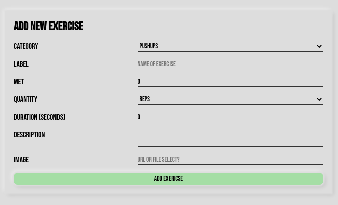
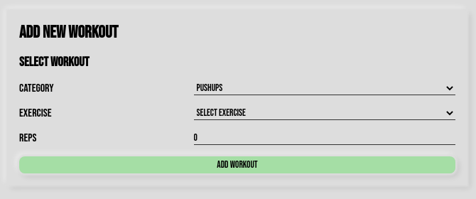
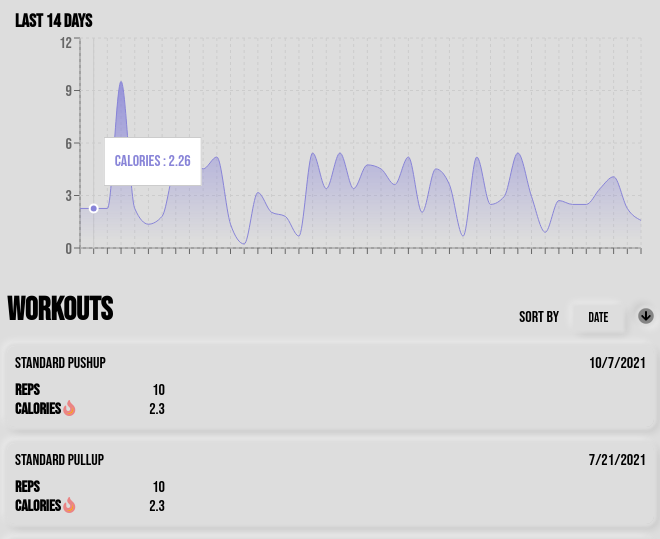
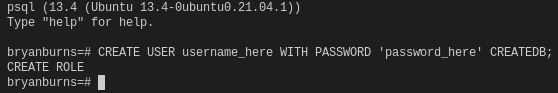

# Health App <a href="https://github.com/bryanlancy/HealthApp/wiki" style="font-size: 18px">Explore the docs »</a>

1. <a href="#what-is-health-app">About</a>
1. <a href="#features">Features</a>
1. <a href="#technologies">Technologies</a>
1. <a href="#setup">Setup</a>

## What is Health App<a href="#sup1">1</a>

    
    

        Health App<a href="#sup1">1</a> aims to provide an easy way to streamline a fine control on all aspects of your health. Combining the control of various metrics such as dieting habits with workout routines, users can make informed decisions about dieting that will compliment their exercise habits, and vice versa.
    

    

        Health App<a href="#sup1">1</a> is designed with <a href="https://wikipedia.org/wiki/Free_and_open-source_software">FOSS</a> in mind, with an added focus on staying free of external dependencies. So with little and trivial setup a user can have an offline and locally hosted version of the application.
    

## Features

### Add custom exercises
In addition to a full assortment of pre-created exercises, users can add new ones for easy customization.

### Easily Add Workouts
If you're exercising on a whim you can add a quickly add a single wokrout without starting a full routine.

### Track Your Stats
Interactive charts make it simple to visualize your progress over different lengths of time.

## Technologies

Frontend

    
    
    

    
    
    

Backend

    
    
    

## Setup

 <em style="font-size: 12px;">
    The following setup assumes that you have PostgreSQL installed and have permissions to add a new user. Documentation can be found <a href="https://www.postgresql.org/">here</a>.
</em>

 

- Clone repository & install Node dependencies
    1. Clone the project with: 
    `git clone https://github.com/bryanlancy/HealthApp.git`

    1. In the root project directory run the command: 
    `npm run install`

- Setup the backend environment
    1. Make a copy of the `.env.example` file found in the `backend` folder and rename it to `.env`.
    1. In the `.env` file, replace all values surrounded in `< >` with the corresponding information. Unless you have already done so, you can generate these values now.

        - `DB_USERNAME` - PostgreSQL user name
        - `DB_PASSWORD` - PostgreSQL user password
        - `DB_DATABASE` - PostgreSQL database name
            - database will be created in a later step.
        - `JWT_SECRET` - JSON Web Token Secret
            - should be unique and secure.

         

        :warning: *The `.env.example` is tracked by git version control, **do not** save any sensitive information in this file.*
    1. Create PostgreSQL user.
        - In your terminal run, `psql`, to start PostgreSQL's interactive terminal.
        - `CREATE USER <DB_USERNAME> WITH PASSWORD '<DB_PASSWORD>' CREATEDB;`. Remember to replace the values in `< >` with the values we created in the previous step.
        
- Create & seed the database
    1. In your terminal, navigate to the `backend` folder found in the main project directory.
    1. Then run, `npm run db-setup`. This will run a series of commands that should automatically set up your database. If any errors occur, you can run the commands individually, in this order.
        1. `npm run db-create`
        1. `npm run db-migrate`
        1. `npm run db-seed`
- Start the application
    1. In your terminal, navigate to the main project folder.
    1. Then run `npm start`. This will start the backend and frontend server.  
        - Each server can be started manually by navigating to the respective folder, `frontend` and `backend`, and running the command `npm start`.
    1. In your browser navigate to <a href="http://localhost:3000">localhost:3000</a>

 1 *Pending better name* :sweat:  

